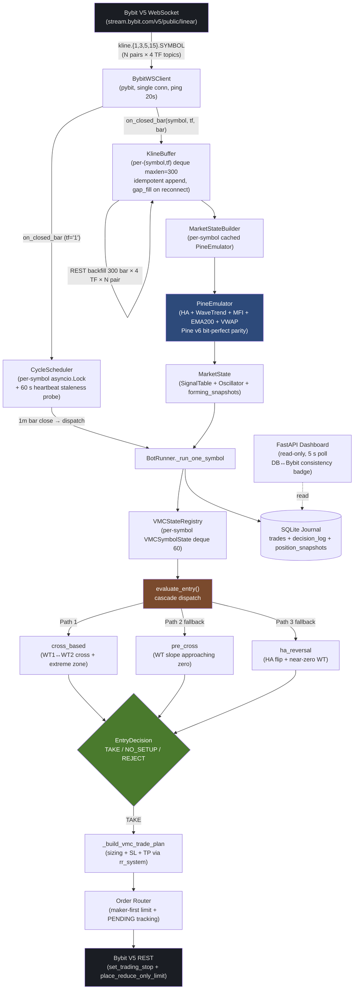

# SMTbot — AI-Driven Crypto Futures Scalper (Showcase)

> **Showcase repo.** The full source is private; this repo documents the architecture, design decisions, and an engineering write-up of the recent infrastructure reform.
>
> **Status:** Sprint 7 forward-test on **25 USDT linear perpetual pairs** on Bybit V5 demo. Strategy: **VMC (HA Strategy)** — WaveTrend reversal entry on 5m + 15m Heikin Ashi, with a 3-cascade entry pipeline and a pure TP/SL exit doctrine.

---

## TL;DR

- **Language / Runtime:** Python 3.11+, `asyncio` event loop, `pybit` V5 SDK
- **Exchange:** Bybit V5 (UTA, hedge mode, USDT linear perpetuals) — demo trading
- **Data path:** Bybit V5 WebSocket + REST → in-memory `KlineBuffer` → `PineEmulator` (Pine v6 bit-perfect parity) → `MarketState` → strategy
- **Strategy:** Mean-reversion / trend-exhaustion entry on 5m HA + 15m HA confirmation + WaveTrend cross + multi-TF soft factor stack
- **Execution:** Maker-first limit entries, position-attached SL + post-only reduce-only TP limit, idempotent break-even lock at MFE 0.75R
- **Sizing:** Compound `wallet × 2%` per trade with margin safety, liquidation safety, fee-aware notional calculation
- **Headline metric:** Cycle latency reformed from **~160 s** (serial TradingView-MCP poll) to **~24 ms / 10 symbols** (WebSocket event-driven, 1 m closed-bar dispatch) — a ~6700× speedup. Cold-start REST backfill ~9.7 s for 300 bars × 4 timeframes × 25 pairs.

---

## Architecture



### Module map

| Layer | Module | Role |
|---|---|---|
| **Data** | `src/data/bybit_ws.py` | pybit WebSocket wrapper, single connection, N×M topic fan-out |
| **Data** | `src/data/kline_buffer.py` | Per-`(symbol, tf)` deque, idempotent append, REST gap-fill |
| **Data** | `src/data/market_state_builder.py` | Per-symbol cached `PineEmulator`, snapshot → `MarketState` glue |
| **Data** | `src/data/pine/` | Pine v6 emulator (HA + WT + MFI + EMA200 + VWAP) |
| **Bot core** | `src/bot/cycle_scheduler.py` | 1 m WS closed-bar → cycle dispatcher + 60 s heartbeat |
| **Bot core** | `src/bot/runner.py` | `BotRunner` outer loop, `_run_one_symbol`, BE-lock watcher, drain loop |
| **Strategy** | `src/strategy/ha_strategy/vmc_planner.py` | Entry decision: `evaluate_entry`, pre-cross, HA-reversal + `_soft_factors` |
| **Strategy** | `src/strategy/ha_strategy/vmc_state.py` | `VMCSnapshot`, `VMCSymbolState`, WT cross + pre-cross helpers |
| **Strategy** | `src/strategy/ha_strategy/vmc_exit.py` | Exit doctrine (simplified — pure TP/SL with master kill) |
| **Strategy** | `src/strategy/rr_system.py` | Sizing (margin + liquidation safety, fee-aware notional) |
| **Execution** | `src/execution/bybit_client.py` | pybit V5 wrapper, symbol boundary translation, kline pagination |
| **Journal** | `src/journal/` | Async SQLite — trades + `decision_log` + `position_snapshots` |
| **Dashboard** | `src/dashboard/` | Read-only FastAPI sibling, 5 s poll, single-page HTML |

---

## Tech Stack

| Category | Choice | Notes |
|---|---|---|
| Language | Python 3.11+ (3.14 supported) | Strict types, `from __future__ import annotations` everywhere |
| Async | `asyncio` event loop | Per-symbol `asyncio.Lock` re-entry guard; background heartbeat + drain + BE-lock tasks |
| Exchange SDK | `pybit` V5 (Unified Trading) | Demo trading account, UTA cross margin, hedge mode |
| Data validation | `pydantic` | `RuntimeConfig` + `MarketState` + `SignalTableData` Pydantic models |
| HTTP | `pybit` (sync → `asyncio.to_thread`) | TR ISP DNS pinning fallback for CloudFront drops |
| Logging | `loguru` | Structured loguru with path-aware Turkish entry log lines |
| Storage | SQLite (`aiosqlite`) | Idempotent migrations, append-only journal, per-cycle `decision_log` |
| Web | FastAPI + vanilla HTML | Read-only dashboard, no React/Vue overhead |
| Tuning | `optuna` (TPE + CMA-ES) | Walk-forward backtest framework with Bayesian + evolutionary tuners |
| Testing | `pytest` | ~640 tests covering strategy, data pipeline, journal, execution |

---

## VMC Strategy — One-pager

VMC is a **reversal entry** strategy: it tries to catch the moment a trend exhausts and reverses, not the continuation. Long on local bottoms, short on local tops.

### Entry — 3 cascade paths

When the per-symbol cycle fires, the bot evaluates entry in three priority-ordered paths. If a path returns `NO_SETUP`, the cascade falls through to the next path; if any path returns `TAKE` or `REJECT`, the cascade stops.

#### Path 1 — `cross_based` (primary)

Five mandatory gates evaluated on the **last closed 5 m bar** (the forming bar is excluded from cross detection):

1. **WT1 ↔ WT2 cross** within last N closed bars (`wt_cross_in_window`)
2. **Extreme zone:** the cross must land on the direction-aligned half-plane (`zone_value ≤ -threshold` for LONG)
3. **WT spread magnitude:** `|wt1 - wt2|` must clear a floor (filters micro-cross noise)
4. **Directional check:** both last closed and forming bar WT spreads must agree with the entry direction
5. **Slope check:** the forming bar WT spread must move toward zero (continuation confirmation)
6. **5 m HA color** must match the entry direction (GREEN for LONG, RED for SHORT)

#### Path 2 — `pre_cross` (fallback)

Catches the *approach* to a cross before it fires. Idea: if the WT spread is sliding monotonically from -15 → -10 → -5 toward zero, a bullish cross is imminent — enter on the slope, don't wait for the cross.

Conditions: all bars in the same hemisphere, monotonic slope toward zero, max depth floor met, current value near zero. Forming bar included (live-candle timing).

#### Path 3 — `ha_reversal` (last fallback)

Catches fast HA color flips that fired without a clean WT cross. Conditions: forming bar + last closed bar both aligned with direction, prior closed bar opposing (fresh reversal), WT spread near zero.

### Scoring — soft factor stack

After the mandatory gates pass, a soft factor stack adds/subtracts from a base score:

| Soft factor | Effect | Mode |
|---|---|---|
| 15 m HA tier (streak-weighted) | ±1.0 / ±1.5 / ±2.0 | Soft (mandatory option) |
| 3 m HA tier (streak-weighted) | ±0.25 / ±0.5 / ±0.75 | Soft (mandatory option) |
| 5 m forming HA color | ±0.5 | Soft |
| 3 m forming HA color | ±0.25 | Soft |
| MFI 3-bar delta | +0.5 (no penalty) | Soft (mandatory option) |
| EMA200 trend alignment | ±1.0 | Soft |
| BTC + ETH composite bias (for altcoin) | ±(weak / strong tier) | Soft |

```
final_score = 2.0 (mandatory base) + Σ(soft factor contributions)
TAKE if final_score >= min_entry_score
```

The threshold is tuned per regime; soft factor weights are derived from CMA-ES tuning over walk-forward backtest cohorts.

### Counterfactual scoring (audit substrate)

Even when no gates pass and the decision is `NO_SETUP`, the soft factor stack is still computed for the best-gate-count direction. The result — "if the gates had passed, the score would have been X" — is written to `decision_log` for later analysis. The bot.log echoes it as:

```
[BTC-USDT-SWAP] symbol_decision: NO_TRADE
  Yol 1 (Cross):       WT cross not found (lookback=2)
  Yol 2 (Pre-Cross):   Pre-cross slope signal absent
  Yol 3 (HA Reversal): Prior bar not opposing
  VMC score: 0.00 [Counterfactual: 3.45 (BULLISH) — would have passed]
```

### Exit doctrine — pure TP/SL + idempotent BE-lock

Four exit paths, no early-exit logic active (early-close master kill is set):

1. **Initial SL** — position-attached, mark-triggered (`algo_trigger_px_type="mark"` for wick survival)
2. **TP** — post-only reduce-only limit, fixed RR multiple of SL distance
3. **Break-even lock at MFE = 0.75R** — when peak unrealized R reaches the threshold, the SL is moved to entry (idempotent, single-shot). Implemented as a **cycle-independent 5 s background watcher** that reads `mfe_r_high` from the position snapshot — guarantees the BE move never misses a peak between cycles
4. **Manual / circuit breaker** — operator override, max consecutive losses, daily loss cap

### Sizing

```
R = wallet_realized × auto_risk_pct_of_wallet         # compound, 2% per cycle
notional = R / (sl_pct + fee_reserve_pct)              # fee-aware
notional ≤ effective_margin × max_leverage × 0.95      # margin safety
SL distance ≤ liquidation distance × 0.6               # liq safety
```

A flat-USD override (`RISK_AMOUNT_USDT`) is supported for fixed-stake testing. Contract rounding uses `ceil` when not capped (overshoot bounded ≤ $3) and `floor` when capped (leverage ceiling reached).

---

## Engineering Write-up — The Bybit V5 Cutover

This is the design story of the recent infrastructure reform that took cycle latency from 160 s to 24 ms.

### The "before" pipeline

The bot originally read all market data through a chain of indirection:

```
TradingView Desktop (Electron CDP debug port)
  → tradingview-mcp (Node.js CLI, JSON-RPC over stdin/stdout)
    → TVBridge (Python) — daemon process
      → StructuredReader (cell-by-cell parse of TV signal table)
        → MarketState
```

Reasoning at the time was straightforward: TradingView's Pine v6 indicators were already producing the exact HA + WaveTrend + MFI + EMA200 values needed by the strategy. Re-deriving them in Python felt redundant. So the bot scraped TV.

The cost was hidden in cycle latency:

- TV Desktop had to be running, focused, and not minimized.
- The MCP daemon was a Node CLI started as a child process; if it died, the bot reconnected but the dead window was 5–15 seconds.
- A serial sweep of 15 symbols × ~11 seconds per symbol = **160–170 seconds per cycle**.
- The Pine "settle gate" (wait for the indicator to refresh after a bar close) added 1–2 seconds per symbol.

This worked, in the sense that trades were placed and PnL was recorded. But it locked the bot to a desktop machine, made parallel symbol scaling impossible, and forced the strategy to think in 5 m TF cadence because no faster polling was practical.

### Phase C — The cutover

The plan was to replace the entire TV chain with a Python-native data path on Bybit V5 WebSocket. Three sub-tasks:

1. **Build a Pine v6 emulator in Python.** Heikin Ashi was straightforward (4-line recursive formula). WaveTrend (LazyBear's WT1/WT2 with the EMA chain over HLC3) took a careful translation from PineScript to Python. MFI and EMA200 were easy. VWAP (session-anchored daily) required getting the bar grouping right.
2. **Subscribe to Bybit V5 WS and feed a `KlineBuffer`.** Per `(symbol, tf)` deque with `maxlen=300`, idempotent `append_closed` (duplicates by timestamp are silently dropped, which matters on reconnect when the server replays). REST backfill at startup; gap-fill on reconnect.
3. **Validate parity.** A diagnostic script (`diag_parity_bybit_emu.py`) pulled the same N bars from both pipelines (TV-MCP + Bybit-emulator) and diffed every signal cell. Bit-perfect: **10/10 symbols, every signal, every bar**.

The cutover landed on 2026-05-15. Steady-state cycle latency, measured with `diag_cycle_perf_bench.py`:

| Pipeline | Cycle cadence | Time per 10 symbols |
|---|---|---|
| Before (TV → MCP → Bridge → Reader) | 5 m TF natural | ~160 s |
| After (Bybit WS → KlineBuffer → PineEmulator) | 1 m WS event-driven | **~24 ms** |

A ~6700× speedup. The bot is now headless, the dispatch is event-driven (no polling), and the 1 m TF gives ×5 the strategy resolution at no latency cost.

### Phase D — Strategy cleanup

With the data path cut over, a follow-up sweep removed ~1900 lines of legacy strategy code that was using the old data shape: the 5-pillar confluence scorer (`multi_timeframe.py`, ~900 LOC), several entry-signal helpers, the weakening-exit knob block, and a handful of state caches that no longer fit the new state model.

The VMC strategy was the sole survivor — it had been written in parallel during late 2026-04 with the cleaner state model in mind. After Phase D, VMC is the only strategy in the runtime.

### What it cost

Two days of careful coding, plus a parity proof. The risk was strategy regression — a single off-by-one in the HA streak counter or a wrong sign in the WT spread would silently change every entry decision. The parity diagnostic was non-negotiable and caught two bugs before they shipped (an HA `prev_haO` initialization edge case, and a WaveTrend signal sample off-by-one).

The post-cutover backtest cohort matched the pre-cutover cohort within ±0.01R per trade — within noise. No regression. The forward-test on 25 pairs began the same day.

---

## Performance — what gets measured

The journal records every decision (entries, rejections, exits) and a 5-minute cadence position snapshot for every open trade. This produces a rich substrate for after-action analysis:

- **Per-cycle decision log** with cascade attempts JSON (which entry path was tried, why each path failed if it did) and counterfactual score (what the score would have been if the gates had passed)
- **Per-trade signal substrate at entry** — 1 m / 3 m / 5 m / 15 m HA color + streak + WT + MFI + RSI + EMA200 snapshot, all stamped to `trades` row
- **Position snapshots** — MFE/MAE high-water marks, mark price tracking, BE-lock timing
- **Close attribution** — TP / SL / BE three-bucket classifier with mark-vs-SL guard for edge cases (mid-market exits when SL is already locked at break-even)

The dashboard (FastAPI + single-page HTML, 5 s poll) renders this as a ledger view of open positions, with PnL chips, MFE/MAE thermometers, hold time, and a DB↔Bybit consistency badge that catches any state drift in real time.

---

## What's not in this showcase

This repo deliberately omits:

- The tuned configuration values (TP RR multiple, per-symbol SL percent, soft factor weights, score thresholds, BTC+ETH bias coefficients) — these were derived from extensive walk-forward + CMA-ES tuning and represent the bulk of the engineering investment
- The full strategy source (`src/strategy/`), execution layer, journal schema, dashboard implementation
- Real trade history, backtest cohorts, and tuning runs
- The internal project brain (`CLAUDE.md`) — design decisions, ongoing sprints, behavioral guidelines
- Pine indicator sources (retired during Phase C but preserved in a rollback archive)

The full project is private. This showcase exists to demonstrate the architecture and engineering approach.

---

## Contact

- GitHub: [@last-26](https://github.com/last-26)
- Portfolio: [last-26.web.app](https://last-26.web.app/)

---

*This README represents the project as of 2026-05-16, post-Phase-D cleanup.*
