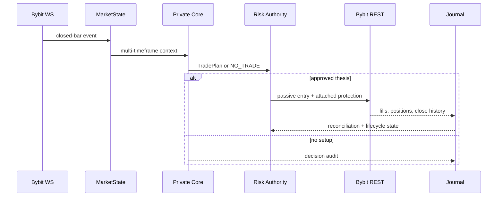
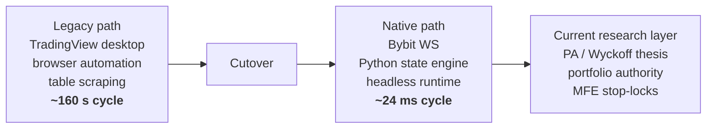
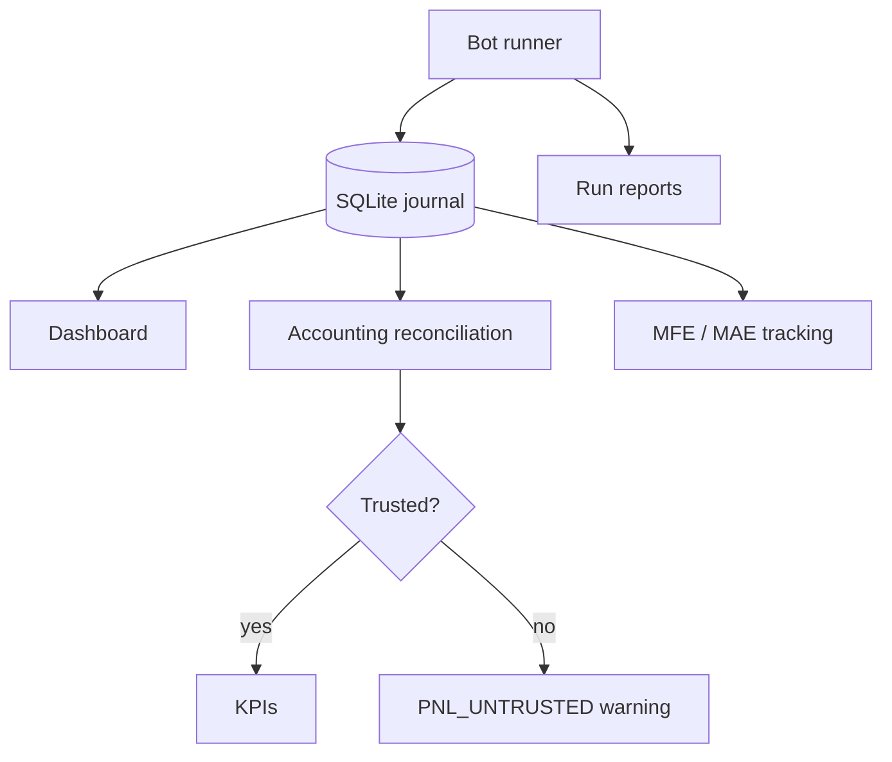

<div align="center">

# SMTbot

**Private trading system. Public engineering showcase.**

[](https://www.python.org/)
[](https://www.bybit.com/)
[](#system-poster)
[](#system-poster)
[](#operator-surface)
[](#showcase-boundary)

</div>

---

<table>
  <tr>
    <td align="center"><b>~24 ms</b><br/>steady cycle<br/><sub>10 symbols x 4 TFs</sub></td>
    <td align="center"><b>~2500x</b><br/>cycle headroom<br/><sub>inside a 1m budget</sub></td>
    <td align="center"><b>63</b><br/>test files<br/><sub>~975 pytest cases</sub></td>
    <td align="center"><b>0 GUI</b><br/>headless runtime<br/><sub>Bybit-native pipeline</sub></td>
  </tr>
</table>

SMTbot is a private crypto futures research bot. This repository is the trailer:
it shows the architecture, operating surface, and engineering direction without
publishing the strategy source, tuned parameters, or trade history.

## System Poster

```mermaid
flowchart LR
    subgraph EX["Bybit V5"]
        WS["WebSocket<br/>closed klines"]
        REST["REST<br/>orders + positions"]
    end

    subgraph DATA["Market Data"]
        WSC["WS client"]
        BUF["Kline buffer"]
        STATE["Market state builder<br/>indicators + PA context"]
    end

    subgraph CORE["Private Core"]
        PA["Price-action / Wyckoff engine"]
        RANK["Candidate ranking"]
        THESIS["Trade thesis"]
    end

    subgraph RISK["Risk Authority"]
        SIZE["Position sizing"]
        GUARD["Circuit breakers"]
        LIFE["Lifecycle rules"]
    end

    subgraph OPS["Operator Surface"]
        EXEC["Order router"]
        DB[("SQLite journal")]
        DASH["FastAPI dashboard"]
        REPORT["Reports + diagnostics"]
    end

    WS --> WSC --> BUF --> STATE
    STATE --> PA --> RANK --> THESIS
    THESIS --> SIZE --> GUARD --> LIFE --> EXEC --> REST
    EXEC --> DB --> DASH
    DB --> REPORT

    classDef exchange fill:#111827,stroke:#F7A600,color:#F9FAFB
    classDef data fill:#0F172A,stroke:#38BDF8,color:#F8FAFC
    classDef core fill:#1E1B4B,stroke:#A78BFA,color:#F5F3FF
    classDef risk fill:#14532D,stroke:#86EFAC,color:#F0FDF4
    classDef ops fill:#1F2937,stroke:#9CA3AF,color:#F9FAFB

    class WS,REST exchange
    class WSC,BUF,STATE data
    class PA,RANK,THESIS core
    class SIZE,GUARD,LIFE risk
    class EXEC,DB,DASH,REPORT ops
```



## Live Cycle



## Current Shape

| Surface | What it demonstrates |
| --- | --- |
| **Data plane** | Bybit V5 WebSocket ingestion, closed-candle discipline, in-process indicator recompute |
| **Analysis plane** | Price action, Wyckoff context, liquidity, market structure, S/R, FVG, order blocks, regime context |
| **Execution plane** | Passive entries, structural invalidation, final target management, exchange reconciliation |
| **Risk plane** | Position sizing, portfolio guards, circuit breakers, MFE stop-lock lifecycle |
| **Ops plane** | Async SQLite journal, read-only dashboard, diagnostics, repair scripts, run reports |

## Engineering Story



The important move was not only speed. It was ownership of the whole trading
loop: market data, state building, decision audit, order lifecycle, and operator
visibility now live in one Python runtime.

## Showcase Boundary

| Public in this repo | Private in SMTbot |
| --- | --- |
| Architecture poster | Strategy source |
| Runtime model | Tuned thresholds and weights |
| Performance shape | Per-symbol risk parameters |
| Module map | Backtest corpus and optimization output |
| Engineering narrative | Real trade history and operator notes |

## Operator Surface



## Stack Snapshot

```text
Python 3.11+      asyncio, pydantic, loguru
Bybit V5          pybit, websockets, httpx
Data/analysis     pandas, numpy, ta
Persistence       aiosqlite
Dashboard         FastAPI, uvicorn
Validation        pytest, diagnostics, smoke tests
```

---

<div align="center">

**SMTbot-Demo is intentionally non-copyable.**

Enough signal to understand the engineering, not enough to clone the edge.

[@last-26](https://github.com/last-26) | [last-26.web.app](https://last-26.web.app/)

</div>
