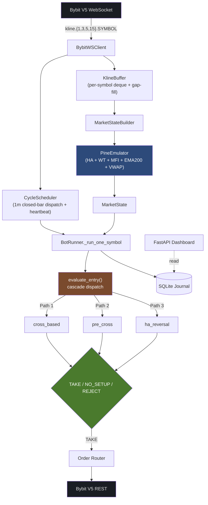

# SMTbot

**An AI-driven crypto futures scalper, running 24/7 on Bybit V5.**

> Showcase repo. Full source is private — this page documents the architecture and shares one engineering story worth telling.

---

## The headline number

**Cycle latency: ~160 s → ~24 ms.**

That's a **~6700× speedup**, achieved by rewriting the data layer from a TradingView desktop scraper into a native Bybit V5 WebSocket pipeline. The bot now runs headless on any Linux box, scans 25 pairs in parallel, and reacts to a closed bar in the time it takes to blink.

---

## Architecture

Event-driven from the bar boundary down to the order placement. No polling, no GUI.

---

## Stack

| | |
|---|---|
| **Language** | Python 3.11+, fully async (`asyncio`) |
| **Exchange** | Bybit V5 (UTA, hedge mode, USDT perps) via `pybit` |
| **Indicators** | Pine v6 emulator (HA, WaveTrend, MFI, EMA200, VWAP) — bit-perfect parity |
| **Storage** | SQLite (`aiosqlite`) — trades, decision log, position snapshots |
| **Tuning** | `optuna` (TPE + CMA-ES) over walk-forward backtests |
| **Dashboard** | FastAPI + vanilla HTML, 5 s poll, live PnL ledger |
| **Tests** | ~640 `pytest` cases — strategy, data pipeline, journal, execution |

---

## The strategy in one breath

A mean-reversion entry that fires at the moment a trend exhausts: WaveTrend cross + Heikin Ashi color flip + a multi-timeframe soft factor stack.

**Three cascade entry paths.** If the primary path doesn't fire, the bot falls through to a slope-based pre-cross detector, then to a fast HA-reversal detector. Each path runs the same scoring engine against direction-aligned signals on 5 m + 15 m + 3 m timeframes plus a BTC/ETH composite bias.

**A single exit doctrine.** Position-attached SL, post-only reduce-only TP limit, and an idempotent break-even lock that fires the moment unrealized P&L crosses a threshold — even if the cycle is mid-flight.

The tuned thresholds, weights, RR multiples, and per-symbol risk parameters live in the private repo.

---

## The Bybit V5 cutover — a short story

The bot's first data layer was a chain of indirection: TradingView Desktop → Electron CDP → Node.js MCP daemon → Python bridge → cell-by-cell signal-table parser. It worked, but it pinned the bot to a Windows machine with TV open, serial-swept 15 symbols in ~160 seconds, and made the strategy think in 5-minute cadence because polling faster was impractical.

A two-day rewrite replaced the entire chain with a Bybit V5 WebSocket subscription + a Python-native Pine v6 emulator. The hard part was parity: a single off-by-one in the HA streak counter or a wrong sign in WaveTrend would silently change every entry decision. A diagnostic script diffed every signal cell between the old and new pipelines — **10/10 bit-perfect** on the first clean build.

The post-cutover backtest cohort matched the pre-cutover cohort within ±0.01R per trade. No regression. The forward-test on 25 pairs began the same day.

---

## What's not in this repo

**The tuned weights.** Six months of historical OHLCV across 25 pairs, fed through a walk-forward backtest harness, then put through a two-stage tuning pipeline — TPE for the wide search, CMA-ES for the refinement. The output is the set of numbers that actually drive the bot: the RR multiple, the per-symbol SL percentage, the soft factor weights, the score threshold, the BTC/ETH composite bias coefficients.

Those numbers *are* the edge. Publishing them would hand the result of months of compute to anyone who copies the file — and turn a private signal into a crowded one. They live in the private repo, and they stay there.

Also withheld: the full strategy source, ~640 tests, the dashboard implementation, real trade history, the internal project brain, and roughly two years of accumulated tuning notes.

This page is the trailer. The film is private.

---

**[@last-26](https://github.com/last-26)** · [last-26.web.app](https://last-26.web.app/)
